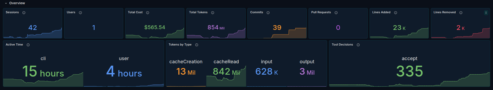
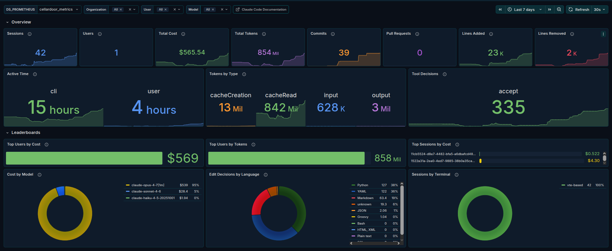
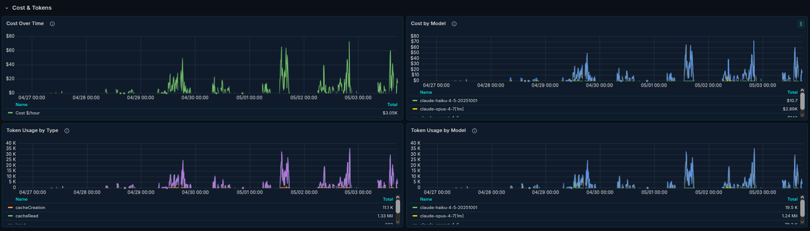
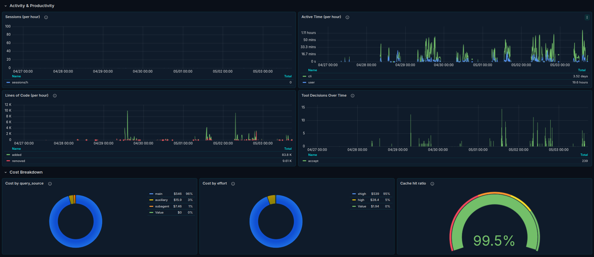

<div class="post-logo-float">


</div>

Claude Code emits OpenTelemetry metrics over OTLP. Anthropic publishes the metric names. So all that was missing, if you run a Prometheus-compatible backend, was a dashboard. Here is one.



- Grafana Labs: [dashboard 25255](https://grafana.com/grafana/dashboards/25255-claude-code-metrics-prometheus/)
- Source: [github.com/rockdarko/claude-code-metrics-prometheus](https://github.com/rockdarko/claude-code-metrics-prometheus)
- License: MIT

It's a port, not original work. The dashboard concept and panel set come from [grafana.com 25052 by 1w2w3y](https://grafana.com/grafana/dashboards/25052-claude-code/), which targets Azure Application Insights via KQL. I rebuilt every panel in PromQL so the same view works against the OSS metrics stack. Credit upstream.

## Why a port was worth doing

When my team started piloting Claude Code, the first thing I went looking for was a dashboard. 25052 was right there, well thought out, exactly the panels I wanted. But it's KQL on Application Insights, and our observability stack is Prometheus and Grafana. As far as I can tell, that's most teams.

The metrics themselves are fine. Claude Code speaks OTLP, and OTLP works with everyone. The gap was just that nobody had wired the receiving end into a PromQL dashboard yet. So I did. Same panels, same intent, different query language. Compatible with Prometheus, VictoriaMetrics, Grafana Mimir, and Thanos.

## The pipeline

```
Claude Code  →  OTLP  →  OTel Collector  →  /metrics  →  Prometheus  →  dashboard
```

If you already run a Collector and a Prometheus-flavored backend, this is three small additions: tell Claude Code where to send OTLP, add a Prometheus exporter to your Collector, add a scrape job. Full setup is in the README, including a minimal Collector config and a scrape file you can copy.

## What you can actually see

The dashboard has five sections.

The Overview gives the at-a-glance KPIs: sessions, users, total cost, total tokens, commits, PRs, lines added and removed, active time, tokens by type.



Leaderboards answer "who is using this and on what." Top users by cost and tokens, top sessions by cost, cost broken down by model, edit decisions by language, sessions by terminal.

Cost & Tokens is the time-series view: cost over time overall and per model, tokens over time by type and by model. Useful when somebody asks "are we still in budget" and you need an answer that isn't a guess.



Activity & Productivity covers active time per hour, lines of code per hour, and tool decisions over time (accept, reject, other).

Cost Breakdown is the part I find most interesting in practice: cost by query source, cost by effort, and cache hit ratio. The cache hit ratio in particular is worth watching. It's the difference between a sustainable bill and an alarming one.



Three filter variables sit at the top of every panel: organization, user, model. Default time range is seven days.

## Per-team, per-project, per-repo views

Out of the box, the metric series carry organization, user, model, terminal, and a session id. There is no `repository` or `project` label, because Claude Code has no opinion about your team's taxonomy.

What it does support is `OTEL_RESOURCE_ATTRIBUTES`. Anything you put there becomes a label on every metric:

```bash
export OTEL_RESOURCE_ATTRIBUTES="team=platform,project=billing-svc,cost_center=eng-123"
```

Set it per shell, per direnv, per repo `.envrc`, per team's onboarding script, whatever fits. Each Claude Code session inherits the value from its environment, the Collector forwards it on, and you can group and filter by it in Grafana like any other label.

The dashboard's built-in template variables (organization, user, model) don't include custom labels yet, but extending it is small work: add a Grafana template variable with `label_values(claude_code_session_count_total, project)` and reference `project=~"$project"` in the panel queries. Or skip the editing and use Grafana's ad-hoc filters, which read the label cardinalities at query time and don't require changing the dashboard JSON.

## Gotchas worth repeating

A few things that bit me or that are easy to miss.

Pin temporality to cumulative. Prometheus-family backends expect cumulative counters. The OpenTelemetry SDK currently defaults to cumulative, but defaults drift across SDK versions, and the failure mode is silent: wrong-looking rates, not an error. Set it explicitly in Claude Code's environment:

```bash
export OTEL_EXPORTER_OTLP_METRICS_TEMPORALITY_PREFERENCE=cumulative
```

The PR counter only counts pull requests that Claude Code itself opened. If your team opens PRs manually after a Claude Code session, the dashboard will show zero. That's how the metric is defined upstream, not a bug in the dashboard.

Cost is a client-side estimate. Claude Code computes it from token counts and known model prices. It tracks billing closely but won't match to the cent, particularly around price changes or cached-token billing.

If `Sessions by Terminal` is empty, set `resource_to_telemetry_conversion: enabled: true` on your Collector's Prometheus exporter. Without it, attribute-derived labels don't make it through.

## What's next

A couple of additions I'd like to make: a token-spend rate panel against a configurable budget, and (once there's enough adoption to ground them in real failure modes) some sample alert rules.

If you run it and find missing panels or buggy queries, open an issue. PRs are welcome, especially around custom labels people are adding via Collector processors. The repo is MIT and the dashboard is on Grafana Labs, ready to import.
